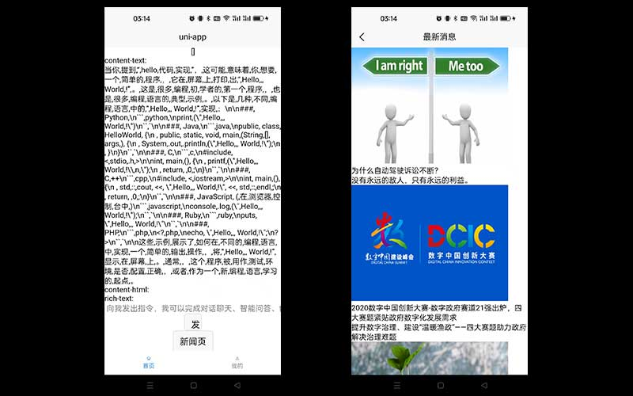

# uni-ai

> 基于uniapp开发的多平台AI助手app。
> 采用 uni-app+vite4+vue3+pinia+uview-plus等技术实现的基于pnpm的monorepo项目
> 支持编译到h5+小程序+APP端。



# 特性

- [x] 工程化（pnpm,monorepo,typescript，prettier，eslint，vscode,commitlint，husky，lint-staged....）
- [x] uniapp环境搭建 （uni-app+vite4+vue3+pinia+uview-plus+sass）
- [x] 获取智谱AI的token，调用GLM-4的接口
- [ ] 样式优化

# 开发

```
pnpm app dev:h5
pnpm app dev:app
```

# 提交代码

```
# 格式化
pnpm format

# 提交
pnpm cz
```
